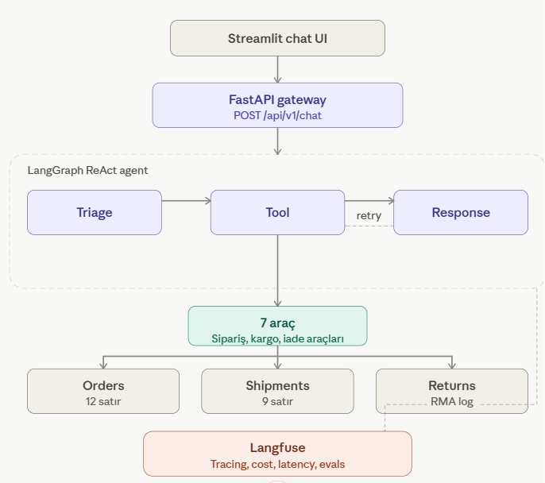
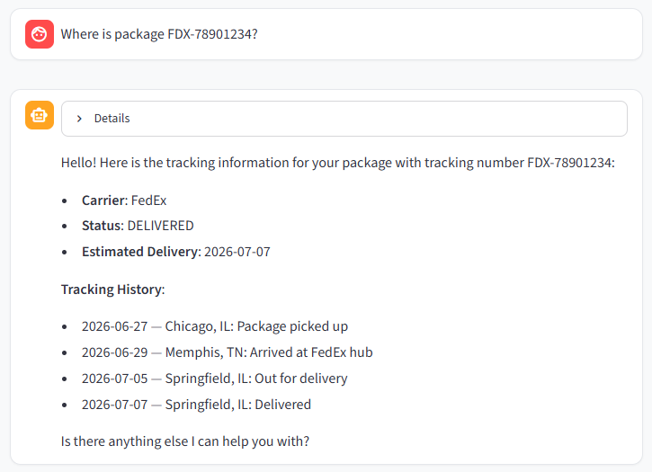
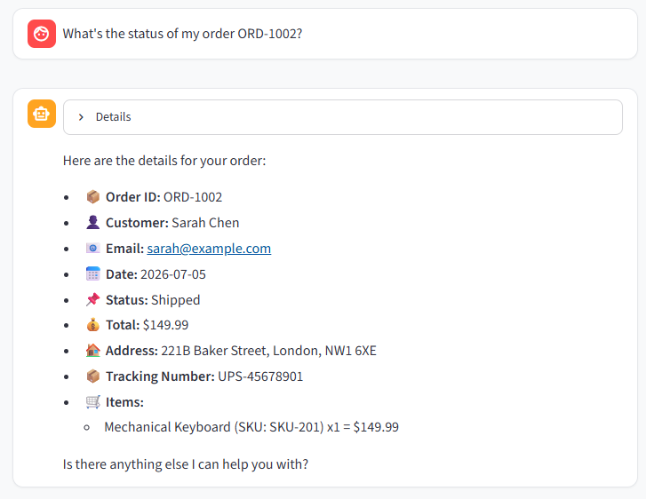

# ● Crate — AI Support Agent

[](https://python.org)
[](https://langchain.com/langgraph)
[](LICENSE)
[](tests/)

> A production-grade **ReAct agent** for e-commerce customer support. Built from scratch with **LangGraph**, **FastAPI**, **Streamlit**, **SQLite**, and **Langfuse** — no black-box frameworks, no pre-built templates.

---

## 📖 Table of Contents

- [Architecture](#-architecture)
- [How It Works](#-how-it-works)
- [Features](#-features)
- [Quick Start](#-quick-start)
- [API Reference](#-api-reference)
- [Project Structure](#-project-structure)
- [Sample Queries](#-sample-queries)
- [Database Schema](#-database-schema)
- [Testing](#-testing)
- [Observability](#-observability)
- [Tech Stack](#-tech-stack)
- [License](#-license)

---

## 🏗️ Architecture



The agent sits behind a FastAPI gateway, exposing a single `/chat` endpoint. Each request flows through a **3-node LangGraph pipeline** backed by SQLite storage and traced end-to-end by Langfuse.

| Layer | Technology | Role |
|---|---|---|
| **Chat UI** | Streamlit | Customer-facing interface with quick-actions and "Details" expander |
| **Gateway** | FastAPI + Pydantic v2 | `POST /api/v1/chat` — async, typed, CORS-enabled |
| **Agent** | LangGraph StateGraph | ReAct loop with conditional routing and retry logic |
| **LLM** | GPT-4o-mini (OpenAI) | Function-calling — the LLM decides *which tool* to invoke |
| **Tools** | 7 custom tools | Order lookup, email search, product search, shipping tracking, returns |
| **Storage** | SQLite | 12 orders + 9 shipments (auto-seeded on first run) |
| **Observability** | Langfuse | Every LLM call, tool execution, latency, and cost — traced in real-time |

---

## 🧠 How It Works

### The ReAct Loop

```
User: "Where is my order ORD-1002?"
  │
  ▼
Triage Node (LLM)
  → classifies: intent = "order_status", order_id = "ORD-1002"
  │
  ▼
Tool Node (LLM + function calling)
  → selects: lookup_order("ORD-1002")
  → executes against SQLite
  │
  ▼
Response Node (LLM)
  → composes English reply from tool result
  → "Here are your order details..."
  │
  ▼
User receives structured answer
```

### Key Design Decisions

**Why 3 nodes?** Separation of concerns. Triage handles classification, Tool handles execution, Response handles composition. Each is independently testable and replaceable.

**Why function calling?** The LLM decides which tool to invoke — not hardcoded rules. This means the agent can handle ambiguous queries like _"my keyboard order"_ by calling `search_orders("keyboard")`.

**Why English?** Prompts are in English, responses are in English, seed data is in English (US addresses, international carriers). A fallback detector catches any Turkish leakage from the LLM.

**Why retry?** The `after_tools` router checks for errors. If a tool fails (e.g., SQLite locked), it loops back up to 3 times before returning a graceful fallback message.

---

## ✨ Features

| Feature | Detail |
|---|---|
| 🧩 **7 Tools** | `lookup_order` · `lookup_orders_by_email` · `search_orders` · `track_shipment` · `get_return_policy` · `check_return_eligibility` · `initiate_return` |
| 🔄 **Retry Loop** | Up to 3 retries on tool errors — graph loops back automatically |
| 🇬🇧 **English-Only** | Prompts + Turkish detection fallback (`_contains_turkish`) |
| 🗄️ **SQLite** | 12 orders, 9 shipments — auto-created on first startup |
| 📊 **Langfuse** | Every LLM call, tool execution, latency, token count, and cost tracked |
| 🧪 **24 Tests** | Services, tools, graph logic — all pass without LLM credentials |
| 🚀 **Single Command** | `python run.py` starts API + UI + opens browser |
| 🔒 **No Leaks** | `.env` gitignored — `.env.example` has placeholders only |

---

## 🚀 Quick Start

### Prerequisites

- Python 3.11+
- OpenAI API key ([get one here](https://platform.openai.com/api-keys))
- (Optional) Langfuse account for tracing ([sign up](https://cloud.langfuse.com))

### 1. Clone & Setup

```bash
git clone https://github.com/m-peker/ecommerce-ai-agent.git
cd ecommerce-ai-agent
python -m venv venv
source venv/bin/activate      # Mac/Linux
venv\Scripts\activate         # Windows
pip install -r requirements.txt
```

### 2. Configure

```bash
cp .env.example .env
```

Edit `.env` and add your API key:
```env
OPENAI_API_KEY=sk-your-key-here
OPENAI_MODEL=gpt-4o-mini
```

> **Optional — Langfuse tracing:**  
> Add `LANGFUSE_PUBLIC_KEY` and `LANGFUSE_SECRET_KEY` to `.env`.  
> Without them, tracing is silently disabled — no errors.

### 3. Run

```bash
python run.py
```

Opens:
- **API** → http://localhost:8000/docs (Swagger UI)
- **Chat** → http://localhost:8501 (Streamlit)

### 4. Test

```bash
pytest tests/ -v    # 24 tests, ~1.5 seconds
```

---

## 📡 API Reference

| Method | Endpoint | Description |
|---|---|---|
| `GET` | `/api/v1/health` | Health check → `{"status":"ok","version":"1.0.0"}` |
| `POST` | `/api/v1/chat` | Send message → agent response |

### Request

```json
{
  "message": "Where is my package FDX-78901234?",
  "session_id": "optional-session-id"
}
```

### Response

```json
{
  "response": "Hello! Here is the tracking information...",
  "intent": "shipping_tracking",
  "order_id": "",
  "tracking_number": "FDX-78901234",
  "customer_email": "",
  "tool_results": {
    "track_shipment": "✅ **FedEx** — FDX-78901234\n📌 Status: DELIVERED..."
  }
}
```

### cURL

```bash
curl -X POST http://localhost:8000/api/v1/chat \
  -H "Content-Type: application/json" \
  -d '{"message":"What is the status of ORD-1002?"}'
```

---

## 📁 Project Structure

```
ecommerce-ai-agent/
├── .env.example                 # Environment template (safe to commit)
├── .gitignore                   # Ignores .env, __pycache__, *.db
├── README.md
├── requirements.txt
├── run.py                       # Single-command launcher (API + UI)
├── images/
│   └── architecture.png         # Architecture diagram
├── src/
│   ├── config.py                # Pydantic settings (reads .env)
│   ├── main.py                  # FastAPI app + startup/shutdown hooks
│   ├── agent/
│   │   ├── __init__.py
│   │   ├── state.py             # AgentState TypedDict
│   │   ├── tools.py             # 7 @tool definitions
│   │   ├── nodes.py             # triage_node, tool_node, response_node
│   │   └── graph.py             # StateGraph builder + retry router
│   ├── services/
│   │   ├── __init__.py
│   │   ├── database.py          # SQLite schema + seed data (12 orders, 9 shipments)
│   │   ├── order_service.py     # Order CRUD + search
│   │   ├── shipping_service.py  # Carrier tracking lookup
│   │   └── returns_service.py   # RMA creation + policy engine
│   ├── observability/
│   │   ├── __init__.py
│   │   └── langfuse_setup.py    # Langfuse client + CallbackHandler
│   ├── api/
│   │   ├── __init__.py
│   │   ├── schemas.py           # ChatRequest / ChatResponse / HealthResponse
│   │   └── routes.py            # POST /chat endpoint
│   └── ui/
│       ├── __init__.py
│       └── streamlit_app.py     # Chat interface with quick-actions
├── data/                        # SQLite DB (auto-created, gitignored)
└── tests/
    ├── __init__.py
    └── test_agent.py            # 24 unit tests
```

---

## 🎯 Sample Queries

Test these in the Streamlit UI or via API:

| Query | What Happens |
|---|---|
| `What's the status of order ORD-1002?` | Triage → `lookup_order` → Response |
| `Where is package FDX-78901234?` | Triage → `track_shipment` → Response |
| `What is your return policy?` | Triage → `get_return_policy` → Response |
| `I want to return ORD-1001` | Triage → `check_return_eligibility` → Response |
| `Show orders for james@example.com` | Triage → `lookup_orders_by_email` → Response |
| `Find my keyboard order` | Triage → `search_orders("keyboard")` → Response |
| `I need to return ORD-1008` | Triage → check → **denied** (outside 14-day window) |
| `Track UPS-99887766` | Triage → `track_shipment` → Response (out for delivery) |

### Demo

**Order lookup with agent reasoning details expanded:**



**Package tracking with full event history:**



---

## 🗄️ Database Schema

The database is auto-created on first startup with realistic seed data.

### `orders` (12 rows)

```
order_id | customer_name    | email               | status      | total   | tracking
─────────┼──────────────────┼─────────────────────┼─────────────┼─────────┼──────────
ORD-1001 | James Wilson     | james@example.com   | delivered   | $105.97 | FDX-78901234
ORD-1002 | Sarah Chen       | sarah@example.com   | shipped     | $149.99 | UPS-45678901
ORD-1003 | Marcus Rivera    | marcus@example.com  | confirmed   | $499.99 | —
ORD-1004 | Emily Foster     | emily@example.com   | cancelled   | $69.98  | —
...
```

### `shipments` (9 rows)

```
tracking     | carrier | status            | location
─────────────┼─────────┼───────────────────┼──────────────────
FDX-78901234 | FedEx   | delivered         | Springfield, IL
UPS-45678901 | UPS     | in_transit        | London → Stansted
DHL-11223344 | DHL     | delivered         | Mountain View, CA
UPS-99887766 | UPS     | out_for_delivery  | Hollywood, CA
FDX-33445566 | FedEx   | in_transit        | Paris, FR (intl.)
...
```

### `returns` (on-demand)

```
rma_number | order_id  | reason       | status   | refund
───────────┼───────────┼──────────────┼──────────┼────────
RMA-1000   | ORD-1009  | defective    | approved | $89.99
```

---

## 🧪 Testing

```bash
pytest tests/ -v --tb=short
```

**24 tests, 4 categories:**

| Category | Tests | Covers |
|---|---|---|
| `TestOrderService` | 11 | CRUD, email lookup, product search, return eligibility (all statuses) |
| `TestShippingService` | 3 | Tracking lookup, missing tracking, readable status |
| `TestReturnsService` | 2 | RMA creation, policy retrieval |
| `TestAgentTools` | 5 | Tool invocation — order lookup, tracking, policy, eligibility |
| `TestGraph` | 3 | Graph construction, node presence, routing logic |

Tests run **without LLM credentials** — they only exercise the service layer and tool logic.

---

## 📊 Observability

When Langfuse keys are configured, every request produces a trace:

```
Trace: chat:Where is package FDX-78901234?  (2.1s, $0.004)
├── ChatOpenAI (triage_node)      0.8s,  120 tokens
├── ChatOpenAI (tool_node)        0.5s,   85 tokens
├── 🔧 track_shipment             0.2s
├── after_tools (router)          <0.1s
└── ChatOpenAI (response_node)    0.6s,  180 tokens
```

**Tracked metrics:** latency per node, token usage, cost estimation, tool success/failure rate.

To enable: sign up at [cloud.langfuse.com](https://cloud.langfuse.com), create a project, and add the keys to your `.env` file.

---

## 🛠️ Tech Stack

| Layer | Technology | Why |
|---|---|---|
| **Agent** | LangGraph 0.2+ | Explicit state graph — debuggable, no magic |
| **LLM** | GPT-4o-mini | Fast, cheap, excellent function calling |
| **API** | FastAPI + Pydantic v2 | Async, auto-docs, type-safe |
| **UI** | Streamlit | Quick to build, looks professional |
| **DB** | SQLite | Zero-config, file-based, perfect for demos |
| **Observability** | Langfuse | Open-source, LLM-native tracing |
| **Testing** | pytest | Fast, readable, no external deps |

---

## 📝 License

MIT — use it, fork it, build on it. Built for learning and portfolio purposes.

